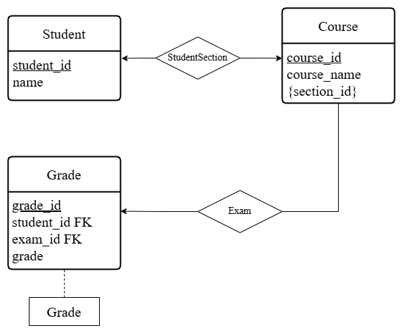

# 方乾 42233017

## 题目一



```
StudentSection(student_id, section_id)
主码: (student_id, section_id)
外键: student_id -> Student(student_id)
       section_id -> Course(section_id)

Exam(exam_id, exam_type, section_id)
主码: exam_id
外键: section_id -> Course(section_id)
```

## 题目二

在所有可能的情况中，无论关系模式 R 中的函数依赖是什么，都会满足BCNF的要求：

- 如果存在函数依赖 A→B，那么 A 是超键。

- 如果存在函数依赖 B→A，那么 B 是超键。

如果关系模式没有非平凡的函数依赖，或函数依赖是自反的，它依然满足BCNF。

因此，对于任何只有两个属性的关系模式 R(A,B)，必定满足BCNF的条件。

## 题目三
分解为：

- $r_1(A,B,C)$

- $r_2(A,D,E)$

---

在 $r_1$ 中，由 A→BC 确保了 A 是超键，因此 $r_1$ 满足BCNF。

在 $r_2$ 中，所有依赖关系已经通过 A→BC 处理完毕，也满足BCNF。
